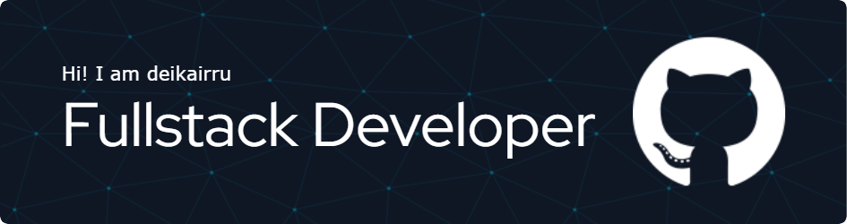

 
  
# 
  
  
  

#
- 👋 Hi, I’m @deikairru, u can call me 'Dee' as in letter 'D'
- 🔥 I’m interested in UI/UX Design and Programming stuff
- 🌱 I’m currently focusing on learning Next js and Flutter
- 💞️ Don't be afraid to start collaborating on any project with me.
- 🥰 U can email directly to me for a collab. I will send you a warm reply.
- 😄 My Traits: ADD/ADHD
- ⚡ Fun fact: I love cat
<!---
deikairru/deikairru is a ✨ special ✨ repository because its `README.md` (this file) appears on your GitHub profile.
You can click the Preview link to take a look at your changes.
--->
